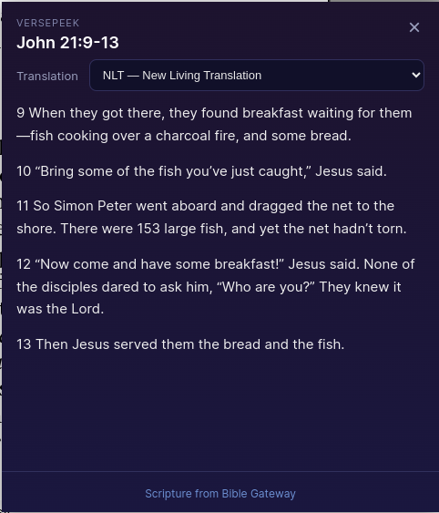
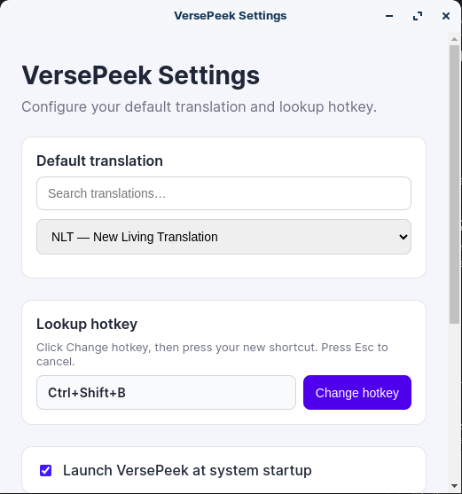

# VersePeek

Highlight a Bible reference anywhere on your desktop and instantly peek at the full passage from Bible Gateway.

**Author:** KaleoTechSolutions  
**Version:** 1.0.0  
**License:** MIT

## Screenshots

<p align="center">
  
</p>

<p align="center">
  <em>Passage popup — read the text and switch translations without leaving your current app.</em>
</p>

<p align="center">
  
</p>

<p align="center">
  <em>Settings — choose a default translation, press-to-bind a hotkey, and enable launch at startup.</em>
</p>

## Features

- Global hotkey lookup (default: **Ctrl+Shift+B**)
- Works from any application — highlight text like `John 3:16`, press the hotkey
- Supports natural references (`Romans chapter 7, verses 18 and 23`) and trailing versions (`John 3:16 NKJV`)
- Default translation: **NLT** (configurable)
- Switch translations in the popup without re-selecting text
- Press-to-bind hotkey in Settings (no need to type Electron accelerator syntax)
- Runs quietly in the system tray

## Download

Get the latest installers from **[GitHub Releases](https://github.com/etopeojo/VersePeek/releases)**.

| Platform | File | Notes |
|----------|------|--------|
| **Linux** | `.deb` | Best for Ubuntu / Debian |
| **Linux** | `.AppImage` | Portable — works on most desktop distros |
| **Windows** | `.exe` (NSIS) | Standard installer (choose install folder) |

> If a release asset is not listed yet, build it locally (see [Build](#build)) or wait for the next published release.

## Install

### Linux — `.deb` (Ubuntu / Debian)

1. Download `versepeek_*_amd64.deb` from [Releases](https://github.com/etopeojo/VersePeek/releases).
2. Install:

```bash
sudo apt install ./versepeek_1.0.0_amd64.deb
```

Or:

```bash
sudo dpkg -i ./versepeek_1.0.0_amd64.deb
sudo apt-get install -f   # only if dependencies are reported missing
```

3. Launch **VersePeek** from your app menu (look for the tray icon).

Update later by downloading a newer `.deb` and running the same install command.

Remove:

```bash
sudo apt remove versepeek
```

### Linux — AppImage

1. Download `VersePeek-*.AppImage` from [Releases](https://github.com/etopeojo/VersePeek/releases).
2. Make it executable and run:

```bash
chmod +x VersePeek-1.0.0.AppImage
./VersePeek-1.0.0.AppImage
```

### Windows

1. Download the Windows installer (`.exe`) from [Releases](https://github.com/etopeojo/VersePeek/releases).
2. Run the installer and follow the prompts.
3. Launch **VersePeek** from the Start menu — it appears in the system tray.

> Unsigned Windows downloads may show SmartScreen warnings. Choose **More info** → **Run anyway** if you trust the source.

## Usage

1. Start VersePeek — it appears in the system tray.
2. Highlight a Bible reference in any app (e.g. `John 3:16`, `Matt. 4`, or `John 3:16 NKJV`).
3. Press **Ctrl+Shift+B** (or your configured hotkey).
4. Read the passage; change translation from the dropdown if desired.
5. Close with the **×** button or **Esc**.

Open **Settings** from the tray menu to change default translation, hotkey, or startup behavior. Use **About VersePeek** for version and author info.

## Requirements

- Linux (X11 recommended) or Windows
- Internet connection for Bible Gateway lookups
- For development/build only: Node.js 18+

## Development

```bash
npm install
npm run dev
```

## Build

```bash
npm run dist:linux   # AppImage + .deb → release/
npm run dist:win     # Windows NSIS installer → release/
```

Unpacked build (no installer):

```bash
npm run pack
```

Installers are written to the `release/` folder.

## Linux notes

- On X11, VersePeek reads the PRIMARY selection buffer when text is highlighted.
- On Wayland, selection capture may be limited; the app falls back to simulating Ctrl+C.
- For global hotkeys on Linux, some desktop environments require the app to run with appropriate permissions.

## Attribution

Scripture text is loaded from [Bible Gateway](https://www.biblegateway.com/) and remains subject to publisher copyrights. VersePeek displays attribution and links back to the source passage.

## License

MIT
